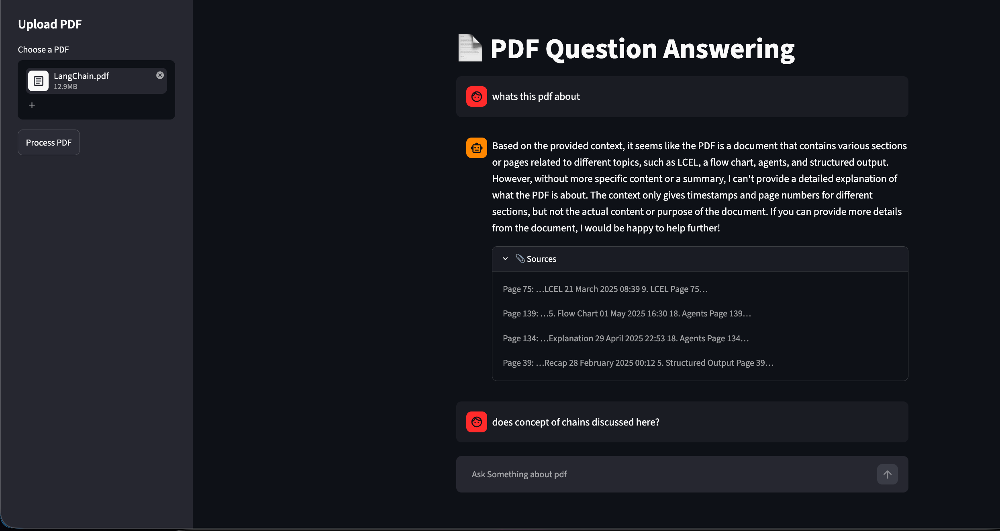

# 📄 PDF Q&A ChatBot

[](https://www.python.org/downloads/)
[](https://streamlit.io/)
[](https://langchain.com/)
[](https://github.com/facebookresearch/faiss)
[](https://huggingface.co/Qwen/Qwen2.5-72B-Instruct)

An interactive, responsive **RAG (Retrieval-Augmented Generation)** web application that allows users to upload PDF documents and have intelligent, context-aware conversations about their content. Powered by **LangChain**, **Streamlit**, **FAISS** (vector store), and **Qwen-2.5-72B** (via HuggingFace Endpoints).

---

## 📸 Application Preview

Below is a preview of the ChatBot answering questions and referencing precise source snippets from the document:



---

## 🚀 Key Features

*   **PDF Document Parsing:** Upload any PDF and automatically load, parse, and structure its content.
*   **Intelligent Text Chunking:** Dynamically splits large documents using a character-based splitter to maintain context window sizing.
*   **Semantic Search & Retrieval:** Employs `sentence-transformers/all-MiniLM-L6-v2` embeddings combined with a **FAISS** vector database for super-fast similarity matching.
*   **Advanced QA Chain:** Builds a retrieval-augmented question-answering chain leveraging the state-of-the-art **Qwen-2.5-72B-Instruct** model.
*   **Source Citation:** Every answer lists the specific pages and text snippets retrieved as sources.
*   **Persistent Session Chat History:** Remembers conversational flow within the active session.

---

## 🛠️ Tech Stack & Libraries

*   **Frontend UI:** [Streamlit](https://streamlit.io/)
*   **LLM Orchestration:** [LangChain](https://github.com/langchain-ai/langchain)
*   **Embeddings:** [Hugging Face Embeddings](https://huggingface.co/sentence-transformers/all-MiniLM-L6-v2)
*   **Vector Search Engine:** [FAISS CPU](https://github.com/facebookresearch/faiss)
*   **Model Hosting:** [Hugging Face Inference Endpoints](https://huggingface.co/inference-endpoints)

---

## ⚙️ Setup & Installation

### 1. Clone & Navigate
```bash
git clone <your-repo-url>
cd "PDF QA ChatBot"
```

### 2. Configure Environment Variables
Create a file named `.env` in the root directory and add your Hugging Face API Token:
```env
HF_TOKEN="your_huggingface_api_token_here"
```

### 3. Setup Virtual Environment
Create and activate a python virtual environment, then install the dependencies:
```bash
# Create environment
python3 -m venv pdfvenv

# Activate environment
source pdfvenv/bin/activate

# Install required packages
pip install -r req.txt
```

---

## 🏃‍♂️ How to Run

With your virtual environment activated and the `.env` configured, run the following command:

```bash
streamlit run app.py
```

Streamlit will launch a local server (typically at `http://localhost:8501`) where you can interact with the app.

---

## 📁 Project Structure

```
.
├── app.py             # Streamlit frontend application & Chat UI
├── rag_pipeline.py    # LangChain RAG pipeline stages (Load, Split, Embed, Retrieve, Chain)
├── chat_history.py    # Session state message dataclasses and history managers
├── req.txt            # Project dependencies
├── .env               # Secrets configuration (ignored by Git)
└── .gitignore         # Untracked files configuration
```
