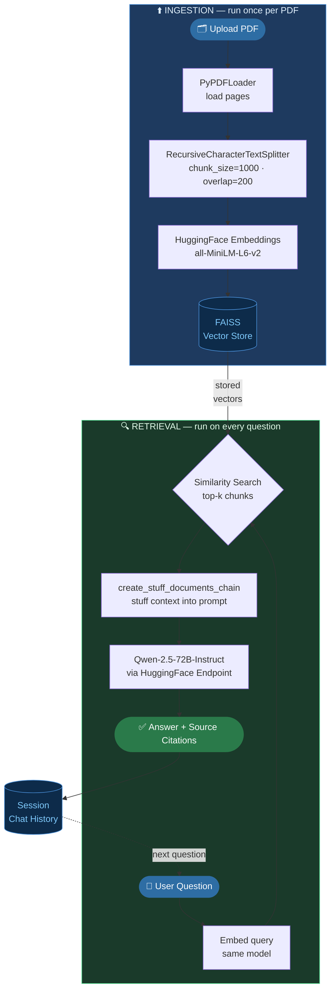

# 📄 PDF Q&A ChatBot

An interactive, responsive **RAG (Retrieval-Augmented Generation)** web application that allows users to upload PDF documents and have intelligent, context-aware conversations about their content. Powered by **LangChain**, **Streamlit**, **FAISS** (vector store), and **Qwen-2.5-72B** (via HuggingFace Endpoints).

---

## 📸 Application Preview

Below is a preview of the ChatBot answering questions and referencing precise source snippets from the document:

---

## 🔄 RAG Pipeline

The application is powered by a two-phase pipeline — **Ingestion** (run once per PDF) and **Retrieval** (run on every question).

> **Ingestion** happens once when the PDF is uploaded — pages are loaded, split into overlapping chunks, embedded into vectors, and indexed in FAISS.
> **Retrieval** happens on every question — the query is embedded, the top-k most similar chunks are fetched, stuffed into the prompt alongside the question, and sent to the LLM for a grounded, cited answer.

---

## 🚀 Key Features

*   **PDF Document Parsing:** Upload any PDF and automatically load, parse, and structure its content.
*   **Intelligent Text Chunking:** Dynamically splits large documents using a character-based splitter to maintain context window sizing.
*   **Semantic Search & Retrieval:** Employs `sentence-transformers/all-MiniLM-L6-v2` embeddings combined with a **FAISS** vector database for super-fast similarity matching.
*   **Advanced QA Chain:** Builds a retrieval-augmented question-answering chain leveraging the state-of-the-art **Qwen-2.5-72B-Instruct** model.
*   **Source Citation:** Every answer lists the specific pages and text snippets retrieved as sources.
*   **Persistent Session Chat History:** Remembers conversational flow within the active session.

---

## 🛠️ Tech Stack & Libraries

*   **Frontend UI:** [Streamlit](https://streamlit.io/)
*   **LLM Orchestration:** [LangChain](https://github.com/langchain-ai/langchain)
*   **Embeddings:** [Hugging Face Embeddings](https://huggingface.co/sentence-transformers/all-MiniLM-L6-v2)
*   **Vector Search Engine:** [FAISS CPU](https://github.com/facebookresearch/faiss)
